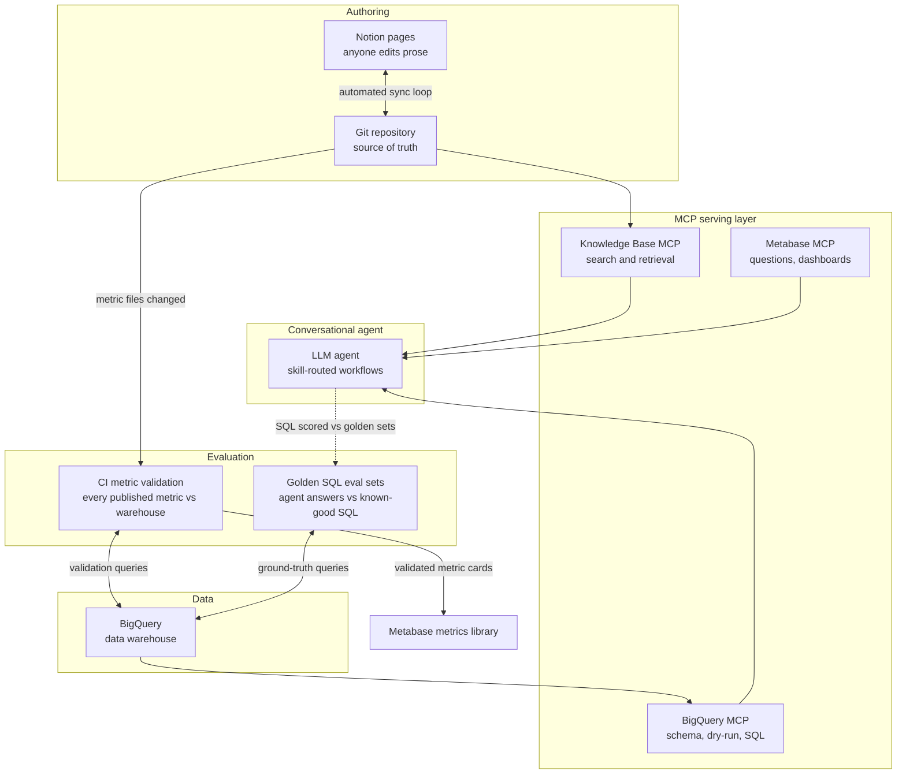

# technical-documentation-ai-agent
Architecture explanation how conversation analytics agent is orchestrated and being used


# Conversational Analytics — System Architecture

> **What this is.** This document describes how we built a conversational analytics system: an AI agent that answers data questions ("what does this metric mean?", "what was last week's DAU by platform?") with answers grounded in reviewed documentation and computed live against the data warehouse — rather than improvised from the model's general knowledge. It covers the knowledge base, the editing pipeline, the MCP serving layer, the agent and its skills, and the evaluation stack.

---

## Table of contents

1. [The core idea](#1-the-core-idea)
2. [System overview](#2-system-overview)
3. [Layer 1 — The knowledge base](#3-layer-1--the-knowledge-base)
4. [Layer 2 — The editing pipeline](#4-layer-2--the-editing-pipeline)
5. [Layer 3 — The MCP serving layer](#5-layer-3--the-mcp-serving-layer)
6. [Layer 4 — The conversational agent](#6-layer-4--the-conversational-agent)
7. [Runtime walkthroughs](#7-runtime-walkthroughs)
8. [Quality and evaluation](#8-quality-and-evaluation)
9. [Design principles](#9-design-principles)

---

## 1. The core idea

A large language model on its own is a sealed box: it knows its training data and whatever is pasted into the conversation. Ask it "what is conversion rate?" and it gives a plausible textbook answer — which may be wrong for *your* company, where "conversion" might mean three different things depending on the team asking.

The system solves this with one principle, applied everywhere:

> **Explanations come from the knowledge base. Numbers come from the BigQuery warehouse. The model's job is routing between them — never inventing either.**

Concretely:

- Every metric the company cares about has a **reviewed definition file**: what it means, why it matters, how to read it, known caveats, and the canonical SQL that computes it.
- The agent retrieves those definitions **at question time** through a search API, so answers cite the company's actual definitions, not the model's general knowledge.
- When a number is requested, the agent takes the canonical SQL, **adapts it** to the requested time window, grain, and dimensions, cost-checks it, executes it against the warehouse, and returns the result with its definition caveats and a confidence score attached.
- Every layer that could silently corrupt an answer — the definitions, the published metrics, the generated SQL — has its own **evaluation mechanism**.

---

## 2. System overview



Four layers, two evaluation planes:

| Layer | What it is | Failure it prevents |
|---|---|---|
| Knowledge base | Versioned Markdown definitions of the business, metrics, and dimensions | The agent inventing definitions |
| Editing pipeline | Git ↔ Notion round-trip with human review | Unreviewed content influencing answers |
| MCP serving layer | Standard-protocol servers exposing the KB, the warehouse, and BI tools | Custom, brittle per-tool integrations |
| Conversational agent | The LLM plus a set of routed skills | Wrong workflow for the question type |
| Evaluation | CI validation of published metrics + golden SQL test sets + runtime confidence scoring | Silent regressions and overconfident answers |

---

## 3. Layer 1 — The knowledge base

The knowledge base is a Git repository of Markdown files. Nothing exotic — the design bet is that plain, versioned, reviewable text is the right substrate for AI-consumed knowledge.

### Content structure

| Folder | Content |
|---|---|
| `business/` | How the business works: the business model, the KPI tree, feature explanations, domain overviews (growth, monetization, fraud, and so on) |
| `metrics/` | One file per metric — 150+ definitions across acquisition, engagement, retention, revenue, and prediction domains |
| `dimensions/` | One file per entity (user, game, acquisition, …) documenting the dimensions available for segmentation and which tables carry them |
| `tools/` | Documentation of the sync tooling itself |
| `.claude/` | Agent-specific skills that live with the content they operate on |

### Anatomy of a metric definition

Every metric file follows the same template, and each section exists for a reason:

```markdown
# <ID> - <Metric Name>

## Definition
One-paragraph plain-language definition, plus an identity table:
ID · machine name · category · tier · maturity · unit · owners · upstream metrics

## Why it matters
Where the metric sits in the KPI tree and what decisions it drives.

## How to read it
The default grain, which dimensions it can be cut by, and how.

## Caveats & gotchas
The traps: definition subtleties, comparability warnings, known data issues.

## Calculation
One or more calc blocks, each declaring:
  Mode · Grain · Source table · Partition column · Date column · Measure
  ...followed by the canonical SQL.
Multiple blocks cover cuts the default table cannot serve
(e.g. a "by ad network" block pointing at a mediation-level table).
```

Three design decisions in this template matter most:

**1. The SQL is a pattern, not a frozen query.** The calc block declares which parts are invariant (the measure expression — the metric's identity) and which are flexible (grain, dimensions, date window). The "How to read it" section explicitly tells the agent which dimensions it may add to the GROUP BY. So when a user asks for the metric at a different grain, the agent is *expected* to rewrite the SQL — within documented bounds.

**2. Ratios are stored as additive components.** A ratio metric's SQL always computes `SAFE_DIVIDE(SUM(numerator), SUM(denominator))` — sums first, divide last — never a pre-computed rate. This single rule is what makes re-graining safe: the ratio recomputes correctly at any grain or dimension cut. (Averaging pre-computed daily rates gives a different, wrong number.) The complementary rule: distinct counts do **not** re-aggregate — you cannot sum daily distinct-user counts into a weekly figure without double-counting; the definition files flag which metrics need a fresh `COUNT(DISTINCT)` over the new window.

**3. Every metric declares a maturity level.** `validated` (confirmed against the warehouse), `directional` (believed correct, unconfirmed), `proposed`, or `blocked`/placeholder. Maturity is machine-readable and directly gates agent behavior — see the confidence section below.

---

## 4. Layer 2 — The editing pipeline

The people who know what metrics *mean* are mostly not the people comfortable editing Markdown in Git. The pipeline resolves this with a bidirectional Git ↔ Notion sync:

```
merge to main ──▶ publisher script ──▶ Notion page (anyone edits the prose)
      ▲                                        │
      │      hourly sync: pull every human edit ▼ into ONE rolling pull request
      └──────────────── human review ◀──────────────────
```

- **Git is the source of truth.** The publisher pushes merged content to Notion; an hourly job pulls human Notion edits back as a reviewable pull request. A code-owners rule routes every PR to a designated reviewer — this single review gate is what makes the knowledge base *trustworthy enough to ground an AI*.
- **Stateless identity.** No page IDs are stored on disk; the file↔page link is rebuilt deterministically from the page's title path on every run. Less state, fewer sync bugs.
- **Ownership is split by content type.** Prose is editable in Notion; frontmatter metadata and code fences (SQL, diagrams) are repo-owned — the sync keeps the repo's version and ignores Notion's. Subject-matter experts polish wording; engineers own the executable parts.
- **Loop safety.** The publisher writes as a bot identity; the sync skips bot edits; formatting normalization is idempotent. The loop cannot feed on itself.
- **Canonical formatting** (one physical line per paragraph, matching Notion's block model) means a one-paragraph Notion edit produces a one-line Git diff — reviews stay readable.

---

## 5. Layer 3 — The MCP serving layer

### What MCP is

MCP (Model Context Protocol) is an open standard for connecting AI models to external systems — often described as *USB-C for AI*. Instead of building a custom integration per tool per AI product, each system runs a small **MCP server** that advertises a menu of tools: each with a name, a plain-language description, and an input schema. The AI client reads the menu, decides which tool fits the current question, calls it with structured arguments, and gets structured data back.

Two properties make this the right boundary:

- **The description does the routing.** The model chooses tools by reading their descriptions — so tool selection quality is a *writing* problem, tunable without touching code.
- **The server bounds the blast radius.** The model never gets raw credentials or arbitrary access; it gets exactly the operations the server's author chose to expose (e.g. read-only SQL, capped bytes billed).

### The servers

**Knowledge Base MCP** — the librarian in front of the KB repo. It indexes the Markdown files and exposes read-only tools:

| Tool family | Intuition | Tools |
|---|---|---|
| "Find me something" | Ranked full-text search, optionally with per-category facet counts | `search`, `search_faceted` |
| "Hand me that document" | Fetch a full document, or just its metadata, by ID | `get`, `get_metadata` |
| "Show me the shelves" | Browse structure without searching | `list_categories`, `list_by_category` |
| "What's related" | Similar documents by keyword and category overlap | `get_related` |
| Housekeeping | Index stats, health check | `statistics`, `ping` |

The facet counts deserve a note: they are the agent's **ambiguity detector**. When a search for a colloquial term returns hits spread across many distinct metric files, the agent learns — before answering — that the term is overloaded and disambiguation is needed.

**BigQuery MCP** — the warehouse gateway:

| Tool | Purpose |
|---|---|
| `execute_sql` | Read-only (SELECT/WITH) execution; DML/DDL rejected; a bytes-billed cap always applied; a `dry_run` mode returns the scan estimate and cost without running anything |
| `get_table_metadata` | Real schema, partitioning, clustering for a table — the ground truth when documentation goes stale |
| `list_datasets` / `list_tables` | Warehouse navigation |
| `get_data_lineage` | Upstream/downstream table relationships |
| `get_data_quality_results` | Latest data-quality scan results per table |

The dry-run tool is load-bearing: every non-trivial query is cost-estimated before execution, so an expensive mistake is caught as a free metadata call rather than a bill.

**Metabase MCP** — the BI surface: construct and run queries, create and update saved questions, metrics, and dashboards. Used when the deliverable is a persistent, shareable artifact rather than an inline answer. Additional servers (Slack, project-tracking, docs) handle output channels.

---

## 6. Layer 4 — The conversational agent

The agent is a general-purpose LLM specialized by **skills** — Markdown playbooks that define workflows for each question type.

### Skill routing: how intent detection works

There is no separate classifier in front of the model. Routing works through **progressive disclosure**:

1. **Every skill has a short frontmatter description** (~a hundred tokens) — and *only* the descriptions are injected into the model's context on every conversation. Together they form a menu of what exists.
2. **The model matches the question semantically** against that menu, as part of ordinary reading. "What is last week's DAU" contains no keyword shared with any description — but it is unmistakably a request for a number, and the data-queries description claims exactly that shape of question.
3. **Only the matched skill's full body is then loaded** — a document of a few thousand tokens containing the complete workflow.

The economics: with ~50 available skills, permanently loading every body would cost ~100k tokens of context per request, mostly irrelevant. Loading 50 descriptions costs ~4k, plus one body on demand. Descriptions are the spines on the bookshelf; bodies are the books.

Routing quality is therefore entirely a function of **how the descriptions are written**, and they are written like classifier rules:

- **Trigger examples in the users' own phrasing** — literal question shapes the skill should catch, including implied intent ("trigger even when causation is only implied").
- **Negative rules** — each description states what it does *not* handle ("not for diagnosing why a number moved").
- **Hand-off clauses** — where to send the excluded cases. Across all skills, these clauses form a distributed decision tree that no single file contains.

### The skill portfolio

| Skill | Claims | Hands off to |
|---|---|---|
| Context/definitions | "What does X mean", how a business mechanic works — explanations only, **never numbers** | Value questions → data-queries |
| Data queries | Any request for a number: values, trends, segment cuts, time series | "Why did it move" → analyst; dashboards → builder |
| Product analyst | Root-cause diagnosis of metric movements, with evidence strength | Raw pulls → data-queries; A/B readouts → experiment analyst |
| Experiment analyst | A/B test significance, novelty effects, ship/extend/kill recommendations | Non-experiment questions |
| Dashboard builder | Persistent BI dashboards and recurring reports | One-off numbers → data-queries |
| Feature planner | Build/investigate/deprioritize recommendations for proposed features | Shipped-feature measurement; live experiments |
| Competitive research | External benchmarks via web research | Internal data questions |
| KB updates | Turns "the KB is wrong/missing X" into a drafted proposal + a review ticket — never edits directly | Reading → context skill |

### Inside a skill body

A skill body is a small program, not a style guide. The data-queries body, as the richest example, contains:

**A context manifest.** Progressive disclosure recurses inside the skill: an `always_load` list (a pinned business-overview document fetched by ID, the connector how-to docs, the confidence rubric) and a `load_on_demand` list (tiebreaker rules only when metrics collide, per-domain framing docs only when judgment is asked for, the delegation contract only when another skill is the caller).

**A round-trip plan.** A *round trip* is one ask→wait→receive cycle with an external tool — and wall-clock on data questions is dominated by these waits, not by reasoning. The skill batches all calls whose inputs are already known into parallel turns:

| Batch | Contents |
|---|---|
| T1 · Find | KB search for the metric + KB search for any dimension + the pinned business-overview fetch — simultaneously |
| T2 · Fetch | All matched documents at once; the execution path is decided after this batch |
| T3 · Verify | Schema checks for every table needing one, in one parallel batch (ad-hoc path only) |
| T4 · Run | SQL execution |

Calls serialize only when one call's input genuinely comes from another's output. The skill sets a budget — a single-metric lookup exceeding ~5 pre-answer tool turns is treated as a bug — and even sanctions speculative calls: a wasted parallel call costs no wall-clock, a missed one costs a whole serial turn.

**The defined-vs-ad-hoc fork.** After reading the metric document, the workflow splits:

- **Defined path** — the calculation is validated, every added column comes from a documented dimension, and the partition column is declared. Then *assemble, don't craft*: the KB calculation **is** the query; the agent adds only the date window and the segment cut, and skips schema verification entirely.
- **Ad-hoc path** — no document covers the metric, dimension, or join. Full source routing, a mandatory real-schema pre-flight (where documentation and live schema disagree, the live schema wins and the doc is flagged stale), and stricter SQL hygiene rules.

**Maturity gates.** A validated metric runs freely. A directional one caps answer confidence at 80%; proposed at 50%. A placeholder calculation does not execute at all — the agent returns the definition and names the gap rather than running SQL it knows is fake.

**A response contract.** Chart-first when the result has a shape; no SQL pasted unless asked; a fixed Sources block naming the metric, tables, documents consulted, and whether the pattern was defined, adapted, or improvised; and a confidence line, always last.

**A delegation contract.** Skills compose: the analyst and dashboard skills can invoke data-queries as a subagent, passing a structured request and receiving structured data back — no chart, no narrative.

### Confidence scoring

Every numeric answer ends with a worked confidence score, governed by a rubric document loaded with the skill. It is applied at two moments:

- **Before execution** (step: reading the metric doc) — the maturity ceilings are established, and a placeholder definition is blocked from executing at all.
- **After execution** (step: composing the answer) — start at 100%, deduct per the rubric's factor table (adapted rather than defined pattern, thin sample, known source limitations), apply the ceiling, and show the arithmetic:

```
Confidence: 80% = 100 − adapted pattern −10 − thin sample −8 → 82, capped at 80 (directional maturity)
```

The score is computed after the data exists because most deductions depend on what actually happened; the ceilings are known before execution so an untrustworthy definition never produces a confidently-presented number.

---

## 7. Runtime walkthroughs

### A definition question: "What is conversion rate?"

1. **Route.** The answer is an explanation → context skill. Contract: KB only, no numbers.
2. **Search.** Faceted KB search for "conversion rate" → in practice, dozens of hits across several distinct metrics (first-purchase conversion, payout conversion, feature-level conversion…). The facet spread is the signal: the term is overloaded.
3. **Disambiguate.** The agent does not pick silently — it either asks which conversion is meant, or leads with the most likely candidate while naming the alternatives.
4. **Retrieve.** Full fetch of the chosen definition file(s): definition, why-it-matters, reading instructions, caveats.
5. **Compose.** The explanation is written *from the retrieved text* — company-specific definition, maturity flagged if unconfirmed, source path cited. No number is returned; if the user follows up asking for the value, that is a hand-off to data-queries.

### A value question: "What was last week's DAU?"

1. **Route.** A value + a time window → data-queries.
2. **KB lookup (T1/T2).** Search finds the DAU definition; the fetch pins down the four things the agent must not guess: source table, measure expression, the mandatory partition filter, and the semantic caveat (in our KB, "active" is revenue-based, not session-based — a caveat that travels with the answer, because comparisons against session-based DAU from other tools will disagree *by design*).
3. **Interpret and adapt.** "Last week" resolves to the last completed Monday–Sunday window. The request is read as the daily series, not weekly distinct users — summing daily DAU across a week would double-count multi-day users; a weekly-actives request would require a fresh distinct count instead.
4. **Dry-run.** The adapted SQL is cost-estimated first. A well-partitioned 7-day query scans megabytes; had it been hundreds of gigabytes, this is where the agent tightens filters before spending.
5. **Execute.** One read-only call; seven rows return.
6. **Respond.** A chart (time series → line), the average and range in one sentence, the definition caveat attached, the sources block, and the confidence line — for a validated metric on the defined path with the canonical pattern untouched: 100%.

Total: four round trips, each genuinely dependent on the previous one's output — the floor for that question.

---

## 8. Quality and evaluation

Three layers, from per-answer to systemic:

| Layer | When it runs | What it catches |
|---|---|---|
| Runtime confidence rubric | Every answer | Overconfidence on weak definitions or adapted patterns — surfaced *to the user* |
| CI metric validation | Every change to a metric file | Wrong published numbers |
| Golden SQL eval sets | Every change to context, skills, or model | Agent regressions on real question shapes |

### CI metric validation (in production)

Metric definitions are also published to the BI tool as reusable metric cards, and the publishing pipeline **validates every card against the warehouse before it can be trusted**:

- The definition's SQL is translated to the BI tool's query format (or wrapped as a native-SQL model when the shape demands it), after verifying the *real* table schema — the pipeline trusts the live schema, never the Markdown.
- Every generated query must pass a free dry-run before use.
- The published card is then executed over a recent completed window, and compared against an independently computed ground-truth query built directly from the base tables — within a 0.5% tolerance. (Cohort metrics that need maturation shift their validation window back one horizon; a scan-size guard skips validation on queries that would be prohibitively expensive, publishing with a warning instead.)
- Every run ends in a three-state gate: **OK** (published and validated, at most by-design informational notes), **WARN** (published, but a human should fix something — a placeholder formula reproduced as-is, a stale schema corrected, a validated number contradicting the file's own documented expectation), or **FAILURE** (unparseable definition, SQL that never dry-runs, API error, or a validation mismatch beyond tolerance). WARN and FAILURE both turn the CI run red.

The tie-breaker between WARN and an OK note: *can a human change something to remove it?* If yes, it warns.

Hard-won correctness rules are encoded in the pipeline: reproduce the documented calculation exactly (never "fix" it silently — warn instead); ratios publish as additive components so they stay cuttable; distinct counts are never rolled up from daily flags (an early mistake here inflated a count 26×); medians publish as means with the methodology stated, because the BI tool's query language cannot aggregate percentiles.

### Golden SQL eval sets (in progress)

For the conversational layer itself — *does the agent produce correct SQL for a natural-language question?* — we are adopting **[nao](https://github.com/getnao/nao)**, an open-source analytics-agent framework with a built-in test command:

1. Golden test cases live as YAML in a versioned `tests/` folder: each pairs a real user question with the SQL that produces the correct answer.
2. The test runner sends each question to the agent, which runs normally (searches context, generates and executes SQL).
3. The agent's final answer is extracted as structured data; the expected SQL is executed against the warehouse for ground truth.
4. The two result sets are compared — exact match first, then approximate with numeric tolerance. A row-count mismatch fails: semantic similarity is not enough, the data must match.
5. Failures produce a value-level diff in a visual dashboard.

Because it is a CI gate rather than a runtime component, any change that could alter agent behavior — knowledge-base edits, skill changes, model swaps — runs the golden set before merge, so a content edit that quietly breaks the SQL for a common question shows up in the pull request, not in a meeting.

Two deliberate choices about the test set: the highest-value cases are not "does the agent reproduce the canonical SQL" (the CI pipeline already validates that) but the **re-grain variants** — the questions where the agent must redesign the SQL and where the real failure modes live. And the set grows from production: a wrong answer caught by a user, plus its corrected SQL, becomes a new test case — so coverage converges on the questions people actually ask.

### What is intentionally not (yet) evaluated

Retrieval quality on KB search and non-SQL answer quality (explanations, diagnostic narratives) have no automated eval yet. Quality there rests on the structural controls: grounding (explanations only from reviewed docs), the human review gate on all content, and the validated metrics library. Extending the golden sets from SQL correctness to *routing* correctness (same questions, assert which skill fired) is the natural next step.

---

## 9. Design principles

1. **Ground truth is versioned text.** Plain Markdown in Git — searchable, diffable, reviewable — turned out to be the right substrate for AI-consumed knowledge. Everything else (Notion editing, BI publishing, MCP serving) is a projection of the repo.
2. **The SQL in a definition is a pattern with declared degrees of freedom.** The agent is expected to rewrite grain, dimensions, and windows — and expected *not* to touch the measure expression. Making that boundary explicit in every file is what makes LLM SQL-rewriting safe.
3. **Descriptions are the routing layer.** Tool and skill selection is driven by natural-language descriptions read by the model. That makes routing an editorial discipline: trigger examples, negative rules, and hand-off clauses — a distributed decision tree maintained as prose.
4. **Progressive disclosure everywhere.** Spines always in context, books on demand — for skills, for their reference docs, for tool schemas. Context is the scarce resource; spend it on the question at hand.
5. **Round trips, not reasoning, dominate latency.** Batch every tool call whose inputs are known; serialize only true dependencies; budget the turns.
6. **Trust the live schema, not the docs.** Documentation goes stale; `get_table_metadata` does not. Where they disagree, the schema wins and the doc gets flagged.
7. **Every number carries its provenance.** Definition caveats, sources, the pattern used, and a worked confidence score travel with every answer — so a consumer can judge how much weight to put on it.
8. **Evaluate each layer with the cheapest mechanism that catches its failure mode.** A tolerance check in CI for published metrics; golden SQL sets for agent behavior; a rubric for per-answer honesty; human review for content. No single eval covers everything — the stack does.
